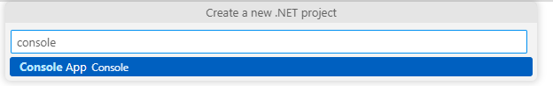
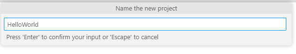
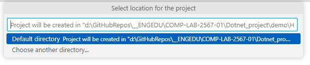
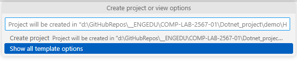
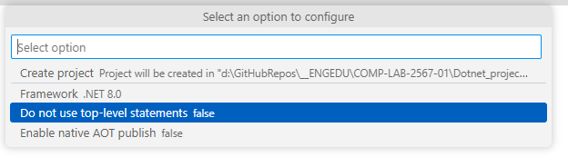
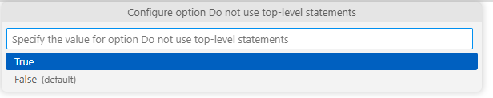
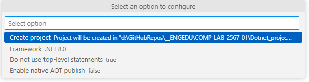
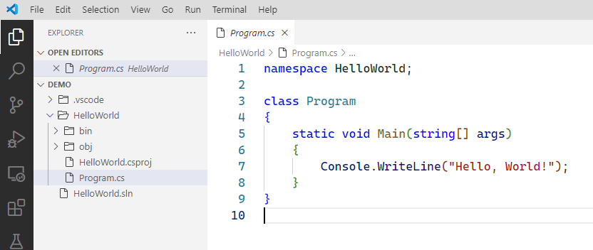
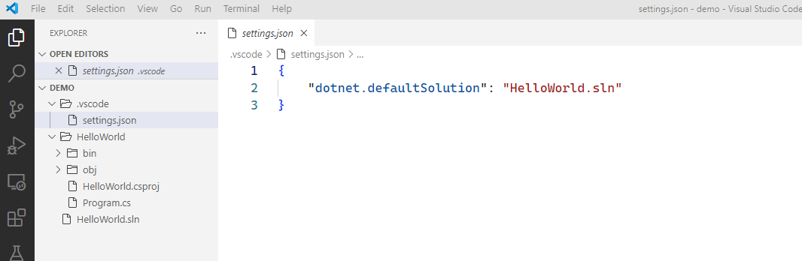
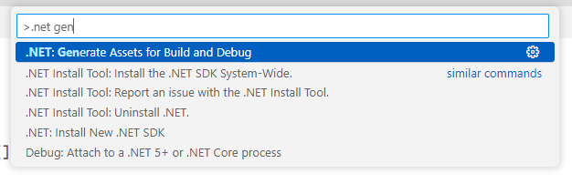

# การทดลอง
## สร้าง .NET console application โดยใช้ Visual Studio Code

ใบงานนี้จะสร้างและเรียกใช้ .NET console application โดยใช้ Visual Studio Code

## การเตรียมการเบื้องต้น

ก่อนการทดลอง ตรวจสอบให้แน่ใจว่าเครื่องคอมพิวเตอร์ผ่านข้อกำหนดต่อไปนี้
- ติดตั้ง Visual Studio Code 
- ติดตั้งส่วนขยาย C# Dev Kit 
- The .NET 8 SDK.

## การสร้าง application

1. เปิด visual studio code
2. เปิด folder ที่จะใช้เก็บ project
3. เรียกเมนู View -> Command Pallette.. หรือกด Ctrl+Shift+P
4. พิมพ์ .net แล้วเลือก `.NET:New Project...` แล้วกด Enter


5. ในช่อง `Search for templates` พิมพ์ console แล้วเลือก `Console App` แล้วกด Enter



6. ตั้งชื่อโปรเจคใหม่เป็น `HelloWorld` แล้วกด Enter



7. เลือกที่อยู่ project แล้วกด Enter



8. เลือก Show all template options แล้วกด Enter



9. เลือก Do not use top-level statements  แล้วกด Enter
    


10. เลือก true  แล้วกด Enter



11. เลือก Framework  (กรณีที่ยังไม่ใช่ 8.0 ให้เข้าไปเลือกเป็น 8.0) 

12. เลือก Create project กด Enter



13. dotnet จะสร้าง project มาให้ ดังรูป เปิดไฟล์ Program.cs จะเห็นเนื้อหาของ source code ดังรูป




## การรัน application


14. ตรวจสอบไฟล์ในโฟลเดอร์ .vscode จะมีไฟล์จำนวน 1 ไฟล์ ชื่อ settings.json และมีเนื้อหาดังรูป



16. เรียกเมนู View -> Command Pallette..
17. พิมพ์ `.net gen` เลือกเมนูดังรูป   



dotnet จะสร้างไฟล์เพิ่มมา 2 ไฟล์คือ launch.json และ tasks.json มีเนื้อหาดังนี้

**launch.json**

``` json
{
    "version": "0.2.0",
    "configurations": [
        {
            // Use IntelliSense to find out which attributes exist for C# debugging
            // Use hover for the description of the existing attributes
            // For further information visit https://github.com/dotnet/vscode-csharp/blob/main/debugger-launchjson.md
            "name": ".NET Core Launch (console)",
            "type": "coreclr",
            "request": "launch",
            "preLaunchTask": "build",
            // If you have changed target frameworks, make sure to update the program path.
            "program": "${workspaceFolder}/HelloWorld/bin/Debug/net8.0/HelloWorld.dll",
            "args": [],
            "cwd": "${workspaceFolder}/HelloWorld",
            // For more information about the 'console' field, see https://aka.ms/VSCode-CS-LaunchJson-Console
            "console": "internalConsole",
            "stopAtEntry": false
        },
        {
            "name": ".NET Core Attach",
            "type": "coreclr",
            "request": "attach"
        }
    ]
}
```

**tasks.json**

``` json
{
    "version": "2.0.0",
    "tasks": [
        {
            "label": "build",
            "command": "dotnet",
            "type": "process",
            "args": [
                "build",
                "${workspaceFolder}/HelloWorld.sln",
                "/property:GenerateFullPaths=true",
                "/consoleloggerparameters:NoSummary;ForceNoAlign"
            ],
            "problemMatcher": "$msCompile"
        },
        {
            "label": "publish",
            "command": "dotnet",
            "type": "process",
            "args": [
                "publish",
                "${workspaceFolder}/HelloWorld.sln",
                "/property:GenerateFullPaths=true",
                "/consoleloggerparameters:NoSummary;ForceNoAlign"
            ],
            "problemMatcher": "$msCompile"
        },
        {
            "label": "watch",
            "command": "dotnet",
            "type": "process",
            "args": [
                "watch",
                "run",
                "--project",
                "${workspaceFolder}/HelloWorld.sln"
            ],
            "problemMatcher": "$msCompile"
        }
    ]
}
```
