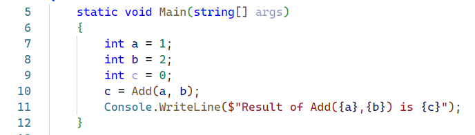
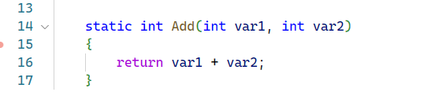
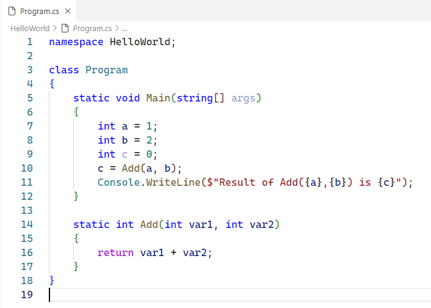

# การทดลอง
## การ debug .NET console application โดยใช้ Visual Studio Code

ใบงานนี้จะทำการ debug .NET console application โดยใช้ Visual Studio Code

## การเตรียมการเบื้องต้น
- โปรแกรม HelloWorld ที่สร้างในใบงาน [Week15_labsheet1.md](./Week15_labsheet1.md)

## การ debug application

1. แก้ไขโปรแกรมในเมธอด `static void Main(string[] args)` ของ ไฟล์ `Program.cs`

2. เพิ่มเมธอด `static int Add(int var1, int var2)`

3. ตรวจสอบให้แน่ใจว่าไฟล์ `Program.cs` มีเนื้อหาดังต่อไปนี้

