# การทดลอง
## การรัน unit test บน console application โดยใช้ Visual Studio Code (ตอนที่ 1)

- ใบงานนี้จะทำการ รัน unit test บน  .NET console application โดยใช้ Visual Studio Code
- เพื่อให้โปรแกรมสามารถ reuse ได้ เราจะทดลองสร้างเป็น class library ซึงสามารถเรียกใช้ได้จากทั้งโปรแกรมแบบ console application, mobile application หรือ web application

## การเตรียมการเบื้องต้น
- 

## การสร้าง class library
1. เปิด visual studio code
2. เปิด folder ที่จะใช้เก็บ project
3. เรียกเมนู View -> Command Pallette.. หรือกด Ctrl+Shift+P
4. พิมพ์ .net แล้วเลือก `.NET:New Project...` แล้วกด Enter

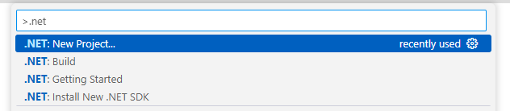

5. ในช่อง `Search for templates` พิมพ์ console แล้วเลือก `Class Library` แล้วกด Enter

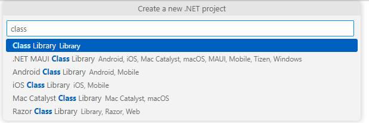

6. ตั้งชื่อโปรเจคใหม่เป็น `CalculatorLibrary` แล้วกด Enter

7. เลือกที่อยู่ project แล้วกด Enter

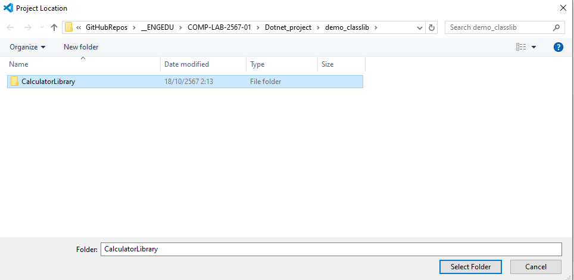

8. ตรวจสอบ .NET Framework ในไฟล์ CalculatorLibrary.csproj ว่าเป็นรุ่น 8.0 หรือไม่

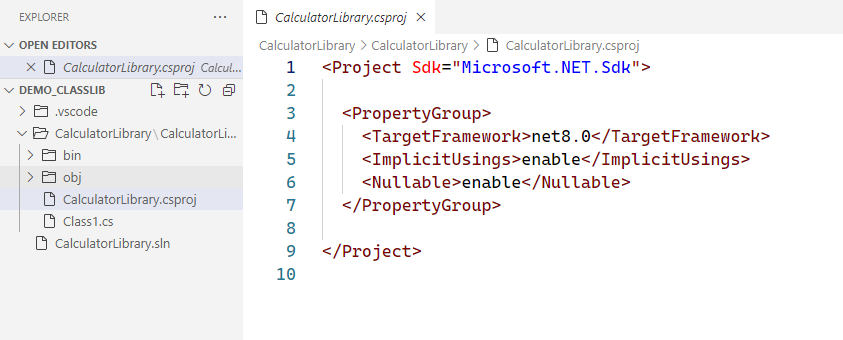

9. เปิดไฟล์ Class1.cs แล้วเปลี่ยน code ให้เป็นดังต่อไปนี้

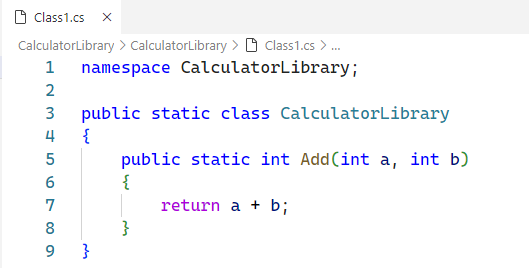

10. เปิดหน้าต่าง SOLUTION EXPLORER  และคลี่โฟลเดอร์ CalculatorLibrary จนเจอไฟล์ project คลิกขวาเพื่อ build

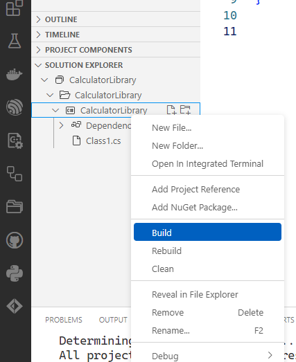

11. ผลจากการ build ควรจะไม่มี error ใดๆ ตามตัวอย่าง

## การใช้งาน class library ใน console application

class library เป็น component ชนิดหนึ่งที่ถูกสร้างขึ้นมาเพื่อการ reuse ซึ่งต้องทำงานใน application อื่น ไม่สามารถเรียกใช้ได้โดยตรง 

ดังนั้นในการทดลองนี้ เราต้องสร้าง host ให้กับ class library ซึ่ง application ที่สร้างง่ายที่สุดคือ console application

12. สร้าง console application ชื่อ Calaulator โดยกระบวนการเดียวกับการทดลองใน [ใบงานที่ 15.1](./Week15_labsheet1.md)

13. เพิ่ม project reference ให้กับ console application เพื่อเรียกใช้ class library ใน SOLUTION EXPLORER ให้คลื่ Calculator ออก แล้วคลิกขวาที่ชื่อ project เลือก Add Project Reference แล้วเลือก CalculatorLibary

14. ตรวจสอบในไฟล์ Calculator.csproj จะเห็นว่ามีการเพิ่ม CalculatorLibrary เข้ามาใน ProjectReference

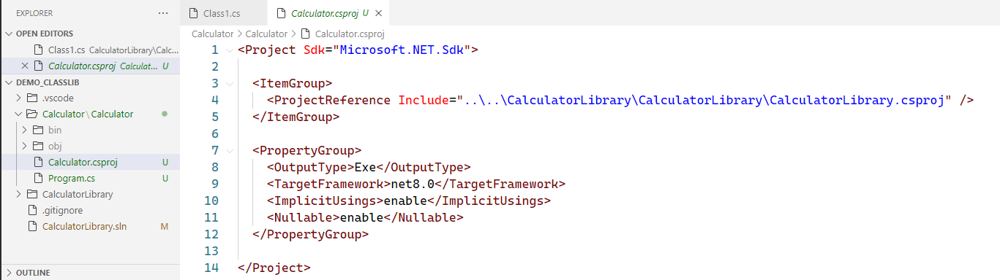

15. แก้ไข code ในไฟล์ Program.cs ให้เป็นดังนี้

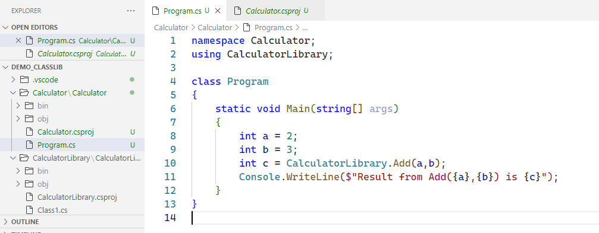

16. ทำตามข้อ 17 ใน [ใบงานที่ 15.1](./Week15_labsheet1.md)
    
17. ในไฟล์ Program.cs ตั้ง break point ในบรรทัด  `int c = CalculatorLibrary.Add(a,b);` 

 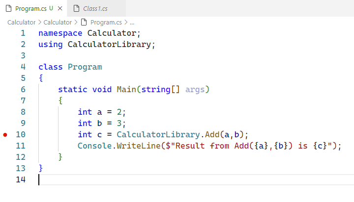

18. กด F5 เพื่อ debug โปรแกรมจะหยุดทำงานที่บรรทัด `int c = CalculatorLibrary.Add(a,b);` 

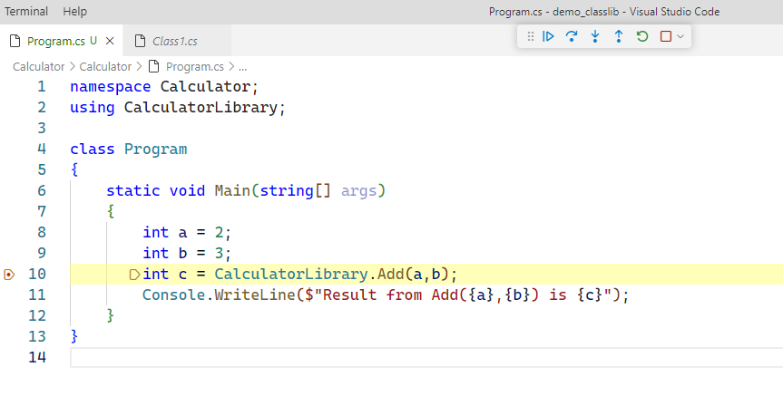

18. กด Step Into (F11) 

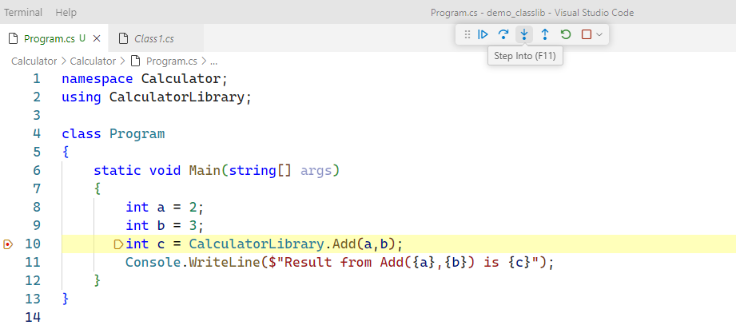

**โปรแกรมจะกระโดดเข้าไปทำงานใน class library**

19. ให้ debug โปรแกรมจนจบ บันทึกสิ่งที่ได้ในแต่ละขั้น
    รูปผลการทดลอง
    
    
    
    
    
    
    

