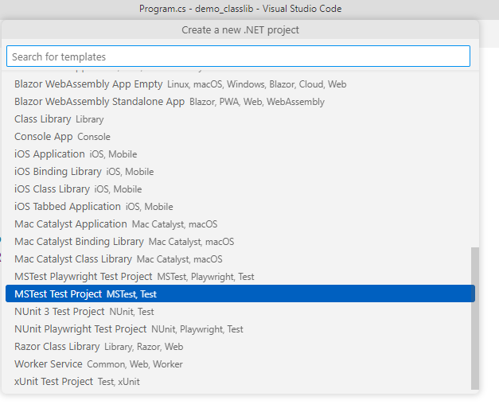
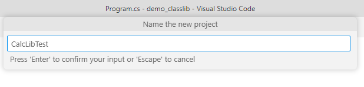

# การทดลอง
## การรัน unit test บน console application โดยใช้ Visual Studio Code (ตอนที่ 2)

- ใบงานนี้จะทำการ รัน unit test บน  .NET console application โดยใช้ Visual Studio Code
- เพื่อให้โปรแกรมสามารถ reuse ได้ เราจะทดลองสร้างเป็น class library ซึงสามารถเรียกใช้ได้จากทั้งโปรแกรมแบบ console application, mobile application หรือ web application

## การเตรียมการเบื้องต้น
- เตรียม classlibrary project ที่ผ่านการทดลองใช้บน console application มาแล้ว 

## การสร้าง unit test project
1. สร้าง project ใหม่โดยเลือกชนิดเป็นดังรูป

2. ตั้งชื่อ project
   

3. เลือกที่ตั้ง project

4. 

